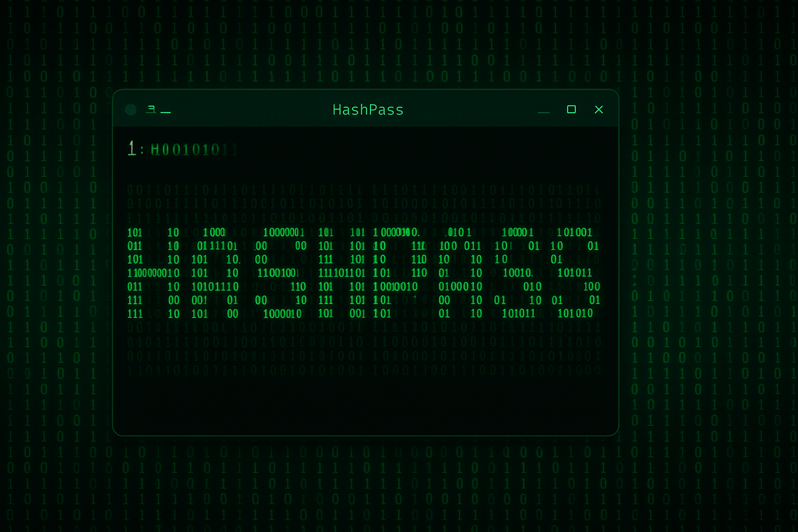

Данная технология позваляет управлять обработкой команд, результатов их выполнения и обработкой перед взятием хэша
Существует 2 вида hooks:
- @command
- @filter


### @command
Суть состоит в том, что можно создать обработчик, который встанет на стыке между вводом команд в терминал и их выполнением:
```python
@command(stages=[0, 1])
def cmd_blacklist(cmd: str, stage: int):
	primary_cmd = cmd.split()[0]
	
	if primary_cmd == 'grep':
		res = {"before": ["echo \"This command is on the blacklist\""]
				, "cmd": []
				, "after": []}
	elif primary_cmd == 'find':
		res = {"before": ["echo \"This command is on the blacklist\""]
				, "cmd": []
				, "after": []}
	else:
		res = {"before": []
				, "cmd": [cmd]
				, "after": []}
	return res
```

Как видно в коде, можно указать этапы, на которых применяется тот или иной хук. Если нужно, чтобы он применялся всегда ```stages=None```

before - добавляет действие до выполнения команды
after - добавляет действие после выполнения команды
cmd - это непосредственно команда или ее замена

Если одновременно находится несколько обработчиков, то обрабатываются они последовательно сверху вниз:

```python
@command(stages=[0, 1])
def cmd_blacklist(cmd: str, stage: int):
	primary_cmd = cmd.split()[0]
	
	if primary_cmd == 'grep':
		res = {"before": ["echo \"This command is on the blacklist\""]
				, "cmd": []
				, "after": []}
	elif primary_cmd == 'find':
		res = {"before": ["echo \"This command is on the blacklist\""]
				, "cmd": []
				, "after": []}
	else:
		res = {"before": []
				, "cmd": [cmd]
				, "after": []}
	return res
	
@command(stages=None)
def cmd_whitelist(cmd: str, stage: int):
    if cmd.split()[0] != 'ls':
        res = {"before": ["echo \"This command is on the blacklist\""]
                , "cmd": []
                , "after": []}

    else:
        res = {"before": ["echo \"This command is not on the blacklist\""]
                , "cmd": [cmd]
                , "after": []}

    return res
```


При этом, before и after могут только расширяться, отменить обработанное до - нельзя

Но cmd можно убрать, удалить, добавить, в качестве параметра всегда передается только исходное значение, это означает, что cmd установится в значение **переданное последним hook**

Если же cmd в результате передастся как ```"cmd": []```, то дальнейшая обработка правил **прекращается**


[](https://rutube.ru/video/private/223fe36ac08b715cd1052539dd8a2e24/?p=pemUIqtMRS_KEfp0Yd7R3g)

### @filter
Суть состоит в том, что можно создать обработчик, который встанет на стыке между чтением файла или получением результата вывода команды и получением символьного хэша. 

Это позволяет убирать корелляции от времени, ключей, размеров файлов. Например, для команды ls -la нужно убрать столбец размера файлов, чтобы вывод не зависел от него:

```python

@filter(stages=None)
def filt_lsal(cmd: str, data: str, stage: int):
	if cmd == "ls -la":
		lines = data.split('\n')
		result = []
		for line in lines:
			if line.strip():
				# Пропускаем пустые строки
				columns = line.split()
				if len(columns) > 1:
					# Берем все кроме предпоследней колонки
					new_columns = columns[:len(columns)-2] + columns[len(columns)-1:]
					result.append(' '.join(new_columns))
				else:
					result.append('')
				else:
					result.append('')
		
		return '\n'.join(result)
		
	else:
		return data
```

Если обработчиков несколько - выполняются все они по очереди сверху вниз

[](https://rutube.ru/video/private/6c1739e3991e1f320c62f08310e01b4d/?p=jKb68ehtNxfCEUwIiv6oqg)
